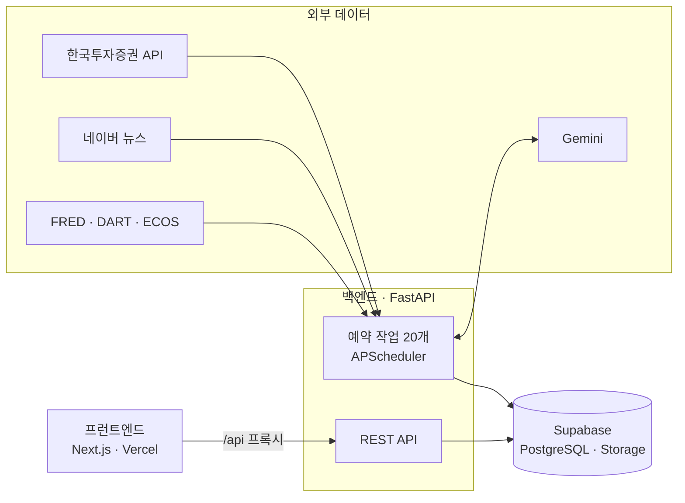

# 🐜 개미굴 (Gaemigul)

> 주식 초보를 위한 AI 시황 대시보드 — 하루 8번, 필요한 시장 정보만 모아 쉬운 말로 설명합니다.

**🔗 서비스** https://gaemigul-app.vercel.app


<!-- 화면 캡처를 docs/images/ 에 넣고 아래 주석을 풀어 주세요

-->

<br>

## 📌 프로젝트 소개

주식을 막 시작한 사람은 봐야 할 데이터가 너무 많고 흩어져 있어, **언제 무엇을 봐야 할지 모르고 봐도 무슨 뜻인지 모릅니다.**
개미굴은 정해진 시각마다 시장 데이터와 뉴스를 모아 AI가 쉬운 말로 풀어 주고, 앞으로의 일정은 캘린더로, 시장 전체 흐름은 히트맵으로 보여 줍니다.

| 구분 | 내용 |
|---|---|
| 형태 | 팀 프로젝트 |
| 기간 | 2026.09 ~ |
| 내 역할 | **백엔드 메인** — 메인 페이지(타임라인·브리핑·시장 데이터) 백엔드, 운영 서버 구축·운영 |

<br>

## ✨ 주요 기능

| 기능 | 설명 |
|---|---|
| **시황 타임라인** | 07:30 글로벌 시황부터 20:00 오늘 시장 분석까지 **하루 8개 시점**의 지표·주도 업종·급상승 종목·주요 뉴스를 모아 AI 브리핑으로 요약 |
| **주린이 해설** | 같은 시황을 주식 입문자용으로 다시 풀어 쓴 해설. 어려운 용어는 호버하면 등급별 설명이 나오는 용어 사전과 연결 |
| **일간·주간 브리핑** | 매일 20:10 그날의 데이터로 AI 일간 보고서를 쓰고, 그 주 마지막 거래일에는 일간 보고서를 묶어 주간 보고서로 정리 (AI 생성 이미지 포함) |
| **시장 지표** | 상단 지표 바(코스피·코스닥·니케이·환율·S&P500·나스닥), VIX, 원/달러 추이, 투자자 수급, 시간대별 거래대금, 자체 시장심리지수 |
| **경제 캘린더** | FOMC·미국 경제지표·국내 기업 실적 발표·옵션 만기 일정을 자동 수집하고 AI가 중요도를 판단 |
| **업종 히트맵** | 코스피·코스닥 업종별 등락을 시가총액 가중으로 시각화하고, 1위 업종의 연관 업종과 최신 뉴스 제공 |
| **회원 기능** | 세션 쿠키 로그인, 투자 등급 진단, 출석 기록, 주간 일정 요약 메일(개미레터) |

<br>

## 🏗 아키텍처



- **수집과 조회를 분리했습니다.** 외부 API 호출은 모두 서버의 예약 작업이 하고, 화면이 부르는 GET API는 저장된 데이터만 읽습니다. 사용자가 늘어도 외부 API 호출량과 비용이 늘지 않습니다.
- **Vercel(HTTPS) → 백엔드(HTTP)는 같은 출처 프록시로 연결했습니다.** 브라우저는 프런트 도메인의 `/api/*`만 호출하므로 mixed content와 CORS 문제가 없습니다.

<br>

## 🙋 내가 맡은 부분 (백엔드 메인)

### 1. 시황 타임라인 파이프라인 (`backend/src/backend/domain/timeline`)
- 한국투자증권·네이버 뉴스 API를 **실제로 호출해 기획 기능의 구현 가능 여부를 먼저 검증**하고, 시간대별로 쓸 수 있는 데이터를 정리했습니다. (예: 정규장 밖에는 KRX 대신 넥스트레이드(NXT) 시세 사용)
- 수집 → LLM 브리핑 생성 → DB 저장 → 조회까지 하루 8회 자동으로 도는 파이프라인을 만들었습니다.
- **재실행해도 안전하게** 만들었습니다. 같은 슬롯은 덮어쓰고(유니크 제약 + upsert), 새로 만든 브리핑이 비면 기존 값을 유지합니다.
- **LLM이 실패해도 슬롯 전체가 죽지 않게** 했습니다. 뉴스 선별·브리핑 단계별로 대체 경로를 두고, 타임아웃에는 재시도를 넣었습니다.

### 2. AI 브리핑 품질 관리
- 첫 실데이터 날 저장된 문장을 원본 데이터·뉴스와 **한 문장씩 대조**해, LLM이 원인을 지어내거나 시제를 틀리는 패턴을 찾아 프롬프트 규칙으로 막았습니다.
- 슬롯끼리 같은 뉴스가 반복되던 문제는 뉴스 구간을 `[직전 슬롯, 현재 슬롯)`으로 나눠 해결하고, 중요도 점수로 기사를 고른 뒤 표시만 최신순으로 했습니다.

### 3. 시장 데이터 · 보고서 (`domain/market`, 보고서 서비스)
- VIX, 원/달러 추이, 투자자 수급, 시간대별 거래대금, **자체 시장심리지수**(모멘텀·상승 비율·외국인 수급·VKOSPI·환율을 최근 60거래일 백분위로 가중 합산) API를 만들었습니다.
- 일간·주간 보고서와 보고서 이미지(AI 생성 + 한글 텍스트 합성 → Supabase Storage 업로드)를 구현했습니다.

### 4. 운영 서버 구축 · 운영
- Oracle Cloud(Ubuntu 24.04)에 systemd 서비스로 백엔드를 배포하고, 예약 작업 시각을 피한 배포 절차와 장애 대응표를 문서화했습니다. → [구축·운영 가이드](docs/OPERATIONS.md)
- 여러 기기가 같은 증권 계좌를 쓰면서 토큰이 서로 무효화되던 문제를, **DB 공유 토큰 저장소**로 바꿔 해결했습니다.

<br>

## 🔧 문제 해결 사례

| 문제 | 원인 | 해결 |
|---|---|---|
| 장 마감 슬롯에서 "상승 1위 업종"이 실제와 다름 | 순위 API 파라미터 기본값 `"0"`이 *당일 저가 대비* 상승률 순이었음 | `"1"`(전일 종가 대비)로 바꾸고, 응답 순서와 상관없이 등락률 최댓값으로 고르는 방어 코드 추가 |
| 개장 전 코스피 등락률이 0.00%로 저장됨 | KIS API가 개장 전에는 가격은 전일 종가로 두고 등락률만 0으로 초기화 | 장 밖에서 0이 오면 일자별 지수의 직전 거래일 등락률로 대체 |
| AI 브리핑이 뒤쪽 슬롯부터 통째로 비어 있음 | Gemini 무료 한도(하루 20회) 초과 | 호출 구조를 점검하고 Lite 모델(하루 200회)로 전환 |
| 외부 API 장애 시 서버가 아예 뜨지 않음 | 서버 시작 단계에서 `httpx` 타임아웃 예외를 잡지 않음 | 시작 시 실패는 해당 기능만 끄고 앱은 정상 기동 |
| 서버를 끄면 실패 원인을 알 수 없음 | 로그를 `print`로만 남김 | `logging`으로 전환하고 파일로 14일 보관 (레벨·스택·KST 시각 기록) |

<br>

## 📁 폴더 구조

```
backend/     FastAPI 서버
  src/backend/core/     외부 API·DB 클라이언트 (KIS, 네이버, FRED, DART, Gemini, Supabase …)
  src/backend/domain/   timeline · market · calendar · heatmap · glossary · auth · attendance
frontend/    Next.js(App Router) 대시보드 — app/(화면), components/, lib/api/(백엔드 호출)
docs/        구축·운영 가이드, 히트맵 설계 자료
```

도메인별 설계 결정과 작업 기록은 각 도메인의 `Claude.md`에 있습니다. (예: [`timeline/Claude.md`](backend/src/backend/domain/timeline/Claude.md))

<br>

## 🚀 로컬 실행

**준비물**: Python 3.14 + [uv](https://docs.astral.sh/uv/), Node.js 20 이상, Supabase PostgreSQL, 각 API 키

```bash
# 백엔드
cd backend
uv sync
cp .env.example .env              # 키 입력 (항목 설명은 .env.example)
uv run python create_tables.py    # 처음 한 번
uv run fastapi run main.py        # http://localhost:8000 (API 문서 /docs)

# 프런트엔드
cd frontend
npm install
npm run dev                       # http://localhost:3000
```

> 백엔드를 켜면 예약 작업이 바로 동작합니다. 서버 구축·배포·운영 절차는 [구축·운영 가이드](docs/OPERATIONS.md)를 참고하세요.

<br>

> ⚠️ 브리핑·해설·보고서는 AI(Gemini)가 생성한 참고용 콘텐츠이며 투자 권유가 아닙니다.
